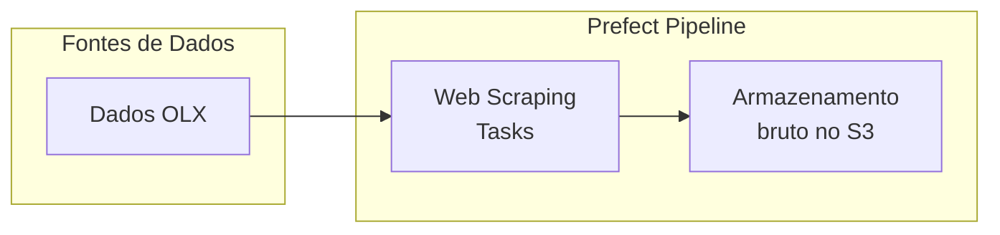
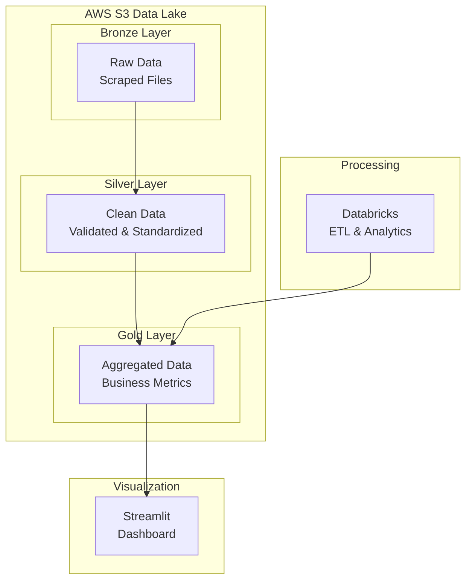

# 🏠 Dados Imobiliários de Petrópolis/RJ

## 📋 Sobre o Projeto

Este projeto tem como objetivo **analisar o cenário imobiliário de Petrópolis, RJ** através da coleta automatizada de dados utilizando técnicas de **web scraping**. A solução implementa um pipeline robusto de extração de dados orquestrado pelo **Prefect**, coletando informações de imóveis anunciados na OLX para análises do mercado local.

### 🎯 Objetivos
- Coletar dados imobiliários de Petrópolis/RJ de forma automatizada
- Implementar pipeline de dados escalável e monitorado
- Analisar tendências do mercado imobiliário local

---

## 🚧 Status do Projeto

**🔄 EM DESENVOLVIMENTO**

### ✅ **Implementado:**
- Pipeline de web scraping com Python e Prefect
- Extração automatizada de dados imobiliários com agendamento no Prefect Cloud
- Orquestração e monitoramento de fluxos

### 🚀 **Próximos Passos:**
1. **Data Lake na AWS S3** - Implementação de arquitetura em camadas
   - 🥉 **Bronze**: Dados brutos extraídos
   - 🥈 **Silver**: Dados limpos e padronizados  
   - 🥇 **Gold**: Dados agregados prontos para análise

2. **Databricks** - Processamento e transformação avançada
   - Implementação de notebooks para ETL
   - Análises exploratórias automatizadas

3. **Dashboard Streamlit** - Interface de análise
   - Visualizações interativas dos dados
   - Métricas do mercado imobiliário
   - Filtros por região, tipo de imóvel e faixa de preço

---

## 🏗️ Arquitetura Atual

### Diagrama de Fluxo

---

## 🛠️ Tecnologias Utilizadas

### **Core Stack:**
- **Python** - Linguagem principal
- **Prefect** - Orquestração de workflows e monitoramento
- **Beautiful Soup + Requests** - Web scraping
- **Pandas** - Manipulação de dados

### **Próximas Tecnologias:**
- **AWS S3** - Data Lake em camadas
- **Databricks** - Processamento distribuído
- **Streamlit** - Dashboard interativo
- **Apache Spark** - Big Data processing

---

## 📊 Dados Coletados

### **Informações dos Imóveis:**
- 🏠 **Tipo**: Casas e apartamentos
- 💰 **Preço**: Venda e aluguel
- 📍 **Localização**: Bairro, endereço
- 📐 **Características**: Área, quartos, banheiros, vagas
- 🏢 **Extras**: Condomínio, IPTU, descrição completa
  
---

## 🎯 Roadmap de Desenvolvimento

### **Fase 1** - ✅ **Pipeline Base** (Concluída)
- [x] Setup do Prefect
- [x] Scrapers básicos
- [x] Validação inicial

### **Fase 2** - 🚧 **Data Lake S3** (Em Progresso)
- [x] Configuração da AWS S3
- [x] Salvamento dos dados brutos no bucket RAW
- [ ] Implementação das camadas Bronze/Silver/Gold
- [ ] Particionamento por data e região
- [ ] Políticas de retenção de dados

### **Fase 3** - 📅 **Databricks Integration**
- [ ] Setup do workspace Databricks
- [ ] Notebooks de transformação
- [ ] Análises exploratórias automatizadas

### **Fase 4** - 📊 **Dashboard Streamlit**
- [ ] Interface web interativa
- [ ] Filtros e visualizações dinâmicas
- [ ] Relatórios automatizados
- [ ] Deploy em cloud

---

## 🚀 Próximas Funcionalidades

### **Data Lake Architecture:**

### **Dashboard Features:**
- 📈 **Análise de Preços** - Tendências temporais e por região
- 🗺️ **Mapas Interativos** - Distribuição geográfica de imóveis
- 📊 **Métricas de Mercado** - Preço médio/m², tempo no mercado
- 🔍 **Filtros Avançados** - Por tipo, preço, localização
- 📱 **Responsivo** - Interface adaptável a dispositivos

---

## ⚠️ Considerações Legais

- **Rate Limiting**: Implementado para respeitar servidores
- **Terms of Service**: Compliance com políticas dos sites
- **robots.txt**: Verificação antes do scraping

---

## 📞 Contato

**Juliana Vieira**
- LinkedIn: [linkedin.com/in/juliana-vieira](https://linkedin.com/in/juliana-vieira)
- Email: julianasalustianovieira@gmail.com
